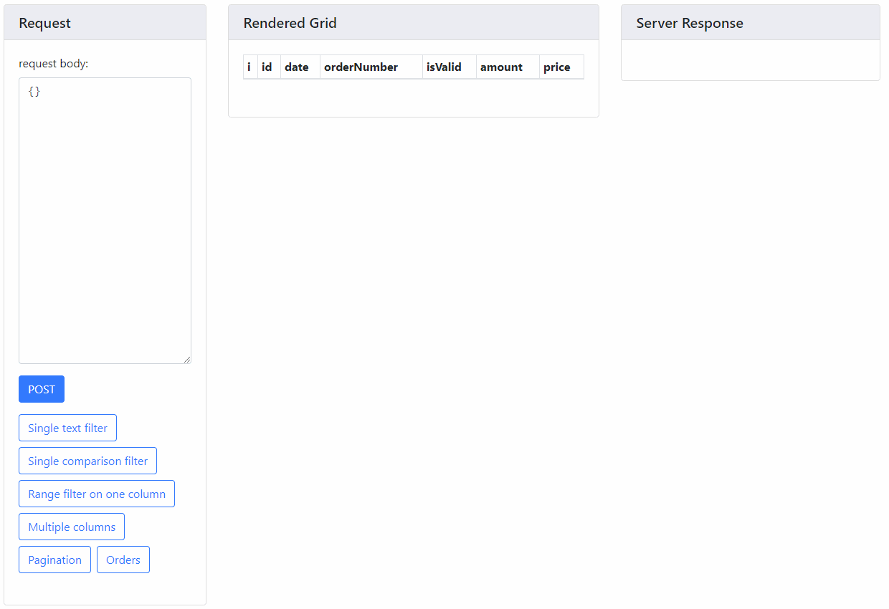

# eaphone-spring-data-query

Customized query binding for [spring-data](http://projects.spring.io/spring-data/).

This is a [sample project](eaphone-spring-data-query-samples) showing how it works.

This project is inspired from [darrachequesne/spring-data-jpa-datatables](https://github.com/darrachequesne/spring-data-jpa-datatables/), which works with spring-data-jpa.

## Quick view ##



## Usage ##

A short but working [example](eaphone-spring-data-query-samples).

### Introduce into project ###

`TODO` Not uploaded to any public Maven Repository yet.

```xml
<dependency>
    <groupId>com.eaphonetech</groupId>
    <artifactId>eaphone-spring-data-query-jpa</artifactId>
    <version>0.4.0-SNAPSHOT</version>
</dependency>
```

OR for MongoDB:

```xml
<dependency>
    <groupId>com.eaphonetech</groupId>
    <artifactId>eaphone-spring-data-query-mongodb</artifactId>
    <version>0.4.0-SNAPSHOT</version>
</dependency>
```

### Initialization ###

In any `@Configuration` class, add:

```java
@EnableMongoRepositories(repositoryFactoryBeanClass = EaphoneQueryRepositoryFactoryBean.class)
```

### Write new Repository ###

Just as spring-data does:

```java
@Repository
public interface UserRepository extends JpaQueryRepository<Order, Long> {
}
```

OR for MongoDB: 

```java
@Repository
public interface UserRepository extends MongoDBQueryRepository<Order, String> {
}
```

Note that `EaphoneQueryRepository` extends `PagingAndSortingRepository` so it already contains functionalities like `findAll(Pageable)` and `save()`.

### Expose fields on view ###

In many cases the data grid shows only part of all fields. In this scenario you can add `@JsonView(QueryOutput.View.class)` to your controller and entity, so only fields marked with `@JsonView(QueryOutput.View.class)` will be displayed in query output.

```java
@Data
@Document(collection = "order")
public class Order {

    @Id
    @JsonView(QueryOutput.View.class)
    private String id;

    @JsonFormat(pattern = "yyyy-MM-dd")
    @JsonView(QueryOutput.View.class)
    private Date date;

    @JsonView(QueryOutput.View.class)
    private String orderNumber;

    @JsonView(QueryOutput.View.class)
    private boolean isValid;

    @JsonView(QueryOutput.View.class)
    private double price;
    
    /** the detail will not show in query result */
    private EmbeddedOrderDetail detail;
}
```

### On the browser side ###

A special designed data grid is designed for this protocol, will be introduced later.

### On the Server Side ###

A repository has the following methods:

* Using Query
  * `QueryOutput<T> findAll(QueryInput input);` for basic simple query
  * `<R> QueryOutput<R> findAll(QueryInput input, Function<T, R> converter);` for query with customized data convert
* Using Specification (JPA only)
  * `QueryOutput<T> findAll(QueryInput input, Specification<T> additionalSpecification);`
  * `QueryOutput<T> findAll(QueryInput input, Specification<T> additionalSpecification, Specification<T> preFilteringSpecification);`
  * `<R> QueryOutput<R> findAll(QueryInput input, Specification<T> additionalSpecification, Specification<T> preFilteringSpecification, Function<T, R> converter);`
* Using Criteria (MongoDB only)
  * `QueryOutput<T> findAll(QueryInput input, Criteria additionalCriteria);`
  * `QueryOutput<T> findAll(QueryInput input, Criteria additionalCriteria, Criteria preFilteringCriteria);`
* Using Aggregation (MongoDB only)
  * `<View> QueryOutput<View> findAll(Class<View> classOfView, QueryInput input, AggregationOperation... operations);`
  * `<View> QueryOutput<View> findAll(Class<View> classOfView, QueryInput input, Collection<? extends AggregationOperation> operations);`

### Examples ###

```java
@GetMapping("/data/orders")
public QueryOutput<Order> getOrders(@Valid QueryInput input) {
    return repo.findAll(input);
}
```

#### MongoDB Aggregation ####

```java
import static org.springframework.data.mongodb.core.aggregation.Aggregation.*;

@GetMapping("/")
public QueryOutput<DataView> getAll(@Valid QueryInput input) {
    return repo.findAll(DataView.class,
        input,
        // just provide your aggregation pipeline here
        lookup("user", "userId", "id", "user"),
        unwind("user"),
        project()
            .and("user.sex").as("user.gender")
            .andInclude(
                "timestamp", "createTime", "sensorType",
                "batchId", "source", "beginTime",
                "endTime", "text", "url", "value")
            );
}
```

## More details on QueryInput ##

A more detailed document is [here](doc/Query.md), and with [中文版](doc/Query.zh-CN.md).

## Future Plans ##

In the near future:

* More complicated tests (and verifications)

## Known Issues ##

* `$match`, `$sum: 1`, `$limit` and `$skip` are attached to given aggregation pipeline so in some cases the logic may be broken.
* Text search is simply converted to Regular Expressions with `Literal` flag and may contain some logical flaws.
* Querydsl support may be missing or error-prone, as my project does not use it.

