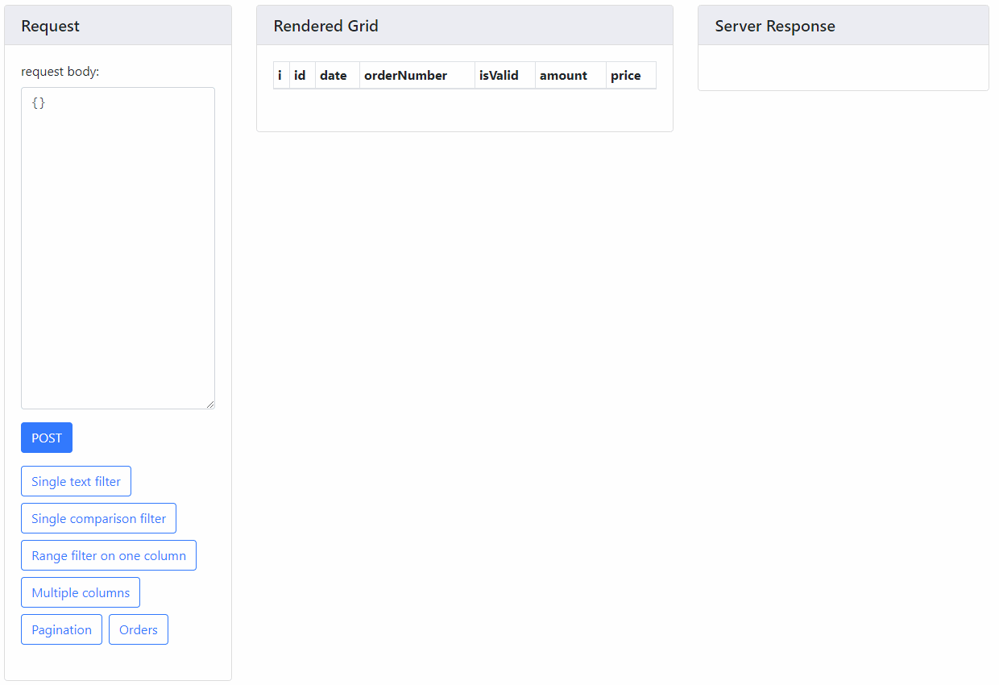

# eaphone-spring-data-query-samples

This is a simple Spring Boot project using [biggates/eaphone-spring-data-query](https://github.com/biggates/eaphone-spring-data-query).

The original sample project is [darrachequesne/spring-data-jpa-datatables-sample](https://github.com/darrachequesne/spring-data-jpa-datatables-sample) 

## How to run ##

(Not verified)

```
mvn spring-boot:run
```

The project will start at `http://localhost:8080/`.

## What is this? ##

This project shows how to use eaphone-spring-data-query in your project, and a very basic version of JavaScript grid.

The web page contains three parts: request (and examples), raw response and rendered grid.



## Features ##

The page contains one data grid, with some pre-defined searching values.

On the page you can try the following features:

* Search by pre-defined columns
* Restrict the date range by providing a custom criteria
* Change order by any single column
* Pagination

## Some details ##

* During the starting process, it inserts `200` completely random rows of `Order` item in `OrderRestController#insertSampleData()`, plus 2 specific `Order` item, in order to provide at least one search result in pre-defined queries.
* The project serves a static web page, displaying a grid using DataTables. The detailed initialization script is in `/index.js`. 

### jpa ###

* An [H2](http://www.h2database.com/html/main.html) in-memory database is created.

### mongodb ###

* This project uses [fakemongo/fongo](https://github.com/fakemongo/fongo) to create an in-memory MongoDB server named `test` (see `SampleConfiguration`).

* The params `startDate` and `endDate` is used to restrict the range of a value. DataTables only handles "match" type of search, which is usually not enough. The criteria and `preFiltering` is used to further define a criteria.  

## Usage in your project ##

If you want to use `eaphone-spring-data-query` in your own project, these steps must be done:

1. Include the library in your project (it's not in any public Maven repository yet)
2. Declare a spring-data repo, extending `JpaQueryRepository<EntityType, KeyType>` or `MongoDBQueryRepository<DocumentType, KeyType>`
3. Create your controller, basically as: 

```
    @Autowired
    private OrderRepo repo;

    @GetMapping()
    public QueryOutput<Order> getOrders(@Valid QueryInput input){
        return repo.findAll(input);
    }
```

4. Write your JavaScript for the datagrid.
